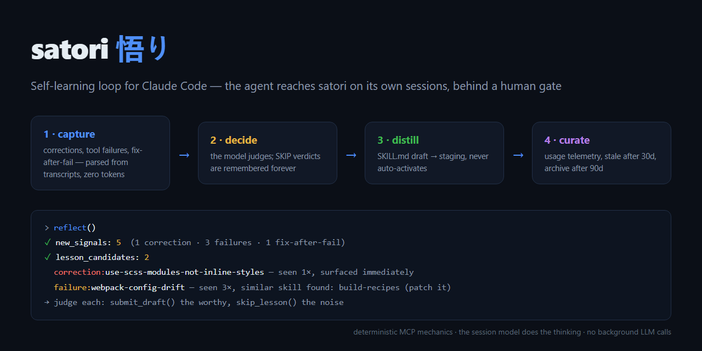
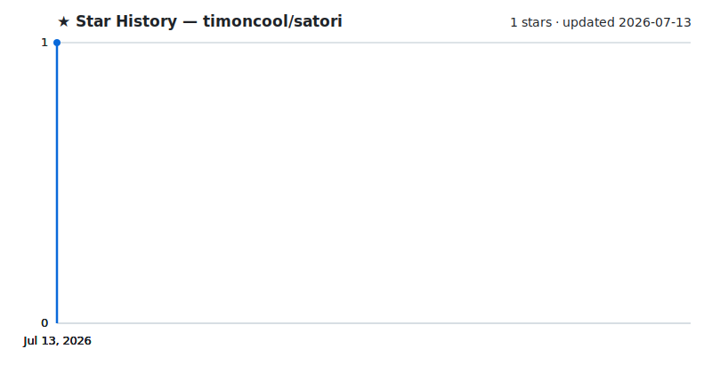

<div align="center">

# satori

**A self-learning loop for Claude Code — the model learns skills from its own sessions, behind a human gate.**

[](#-beta-disclaimer)
[](LICENSE)
[](https://github.com/timoncool/satori/stargazers)
[](https://github.com/timoncool/satori/commits)

**[English](README.md)** · **[Русский](README_RU.md)**



</div>

> ### ⚠️ Beta disclaimer
> This is **beta software** I build for myself and share with the community as-is. It parses your session transcripts, stores lesson data locally and drafts skills that — once **you** approve them — will instruct your future Claude sessions. Read `server.py` and the drafts in `staging/` before approving anything. It works on my setup; I can't guarantee yours and **take no responsibility** for what your agent learns. Nothing self-activates and everything is reversible — but the judgment is yours.

satori is an MCP server + hooks that give Claude Code a closed self-learning loop: user corrections and tool failures become lesson candidates, lessons become skill drafts, drafts become active skills — but only through a gate. Windows-native, works in Claude Desktop, zero bash wrappers.

Two principles you won't find together elsewhere: **the server does only deterministic mechanics** (parsing, counters, storage, validation) — the thinking is done by the calling model right in the session, no background LLM calls, no extra bills; and **nothing self-activates** — drafts sit in staging until explicitly approved.

## Features

- **4-stage loop** — capture → decide → distill → curate; `reflect()` is called several times per session
- **User correction = signal #1** — surfaces as a candidate after a single occurrence (Devin's mechanic); tool failures wait for recurrence
- **Patch-not-append** — a recurring signal bumps `seen_count` instead of piling up rows
- **SKIP gate, forever** — "not skill-worthy" verdicts are remembered; rejected noise never comes back
- **Staging instead of auto-write** — a draft activates only via `approve_draft` (by you, or by the wake skill)
- **The trigger is sacred** — `description: Use when ...` is mandatory: recall works when a note says *when* to recall it, not what it does
- **pinned_project** — a lesson is global or pinned to one project; approve routes it to the right skills folder
- **Draft validation** — frontmatter, size, secrets (also redacted at rest), prompt-injection markers (EN+RU)
- **FTS5 search over past sessions** — "when did I fix exactly this error" finds the actual transcript
- **Curator** — usage telemetry; unused drafts go stale in 30 days, archived in 90
- **Smart nudge hooks** — silent by default; they speak only on a correction (instantly) or accumulated work; a declined nudge stays declined
- **Visible audit trail** — every loop event surfaces in chat as a ⛩ marker line: what fired, why, what was staged or skipped
- **dream/wake integration** — the [dream-skill](https://github.com/timoncool/dream-skill) consolidation pass harvests satori's staging and promotes/retires drafts through its validator gate

## Quick Start

**Easiest — let Claude install it.** Paste this message into Claude Code:

```text
Install the satori self-learning loop from https://github.com/timoncool/satori:
1) clone the repo to a permanent location (not a temp dir — the MCP runs from it);
2) create a venv inside it and install the single dependency: fastmcp;
3) register the MCP in my .mcp.json (project or global) as "satori" with
   command = absolute path to the venv python and args = [absolute path to server.py];
4) recommended: add the three nudge hooks (UserPromptSubmit / Stop / SessionEnd,
   all calling hooks/nudge.py with the venv python — exact JSON is in the README
   "Quick Start" step 3) into ~/.claude/settings.json, PRESERVING my existing hooks;
5) smoke-test: import server in the venv and show me what got configured;
then remind me to restart Claude Code / Desktop so the MCP and hooks load.
```

That's it — Claude clones, wires configs, verifies and reports. Manual way:

1. **Clone & install the one dependency**
   ```bash
   git clone https://github.com/timoncool/satori.git
   cd satori && python -m venv .venv && .venv\Scripts\pip install fastmcp
   ```

2. **Register the MCP** — in your project's `.mcp.json` (or global config):
   ```jsonc
   "satori": {
     "command": "<path>\\satori\\.venv\\Scripts\\python.exe",
     "args": ["<path>\\satori\\server.py"]
   }
   ```

3. **(Optional) nudge hooks** — three hooks onto one script in `~/.claude/settings.json`:
   ```jsonc
   "UserPromptSubmit": [{"matcher": "", "hooks": [{"type": "command", "command": "<venv-python> <path>/hooks/nudge.py prompt-submit", "timeout": 10}]}],
   "Stop":             [{"matcher": "", "hooks": [{"type": "command", "command": "<venv-python> <path>/hooks/nudge.py stop", "timeout": 10}]}],
   "SessionEnd":       [{"matcher": "", "hooks": [{"type": "command", "command": "<venv-python> <path>/hooks/nudge.py session-end", "timeout": 60}]}]
   ```
   Restart Claude Code / Desktop.

## How it works

```
session transcript
      │  (hook/tool call — parsing costs 0 tokens)
      ▼
① capture   reflect() reads what's new since the stored offset: corrections,
            failures, fix-after-fail, complex segments (≥12 calls + ≥2 edits)
      ▼
② decide    the model judges candidates (corrections after 1×, the rest after 2×):
            noise → skip_lesson (forever), worthy → a draft
      ▼
③ distill   submit_draft → staging/, validated, backed up, provenance-stamped.
            Does NOT activate. approve_draft → ~/.claude/skills/ or the project
      ▼
④ curate    usage telemetry, stale at 30d, archive at 90d
```

**Hooks** (all optional, all silent by default): `UserPromptSubmit` — on a correction injects one line "fix it, then reflect" (series-deduplicated); on ≥25 accumulated tool calls — same, and repeats only after the next full threshold; `Stop` — same threshold at turn end; `SessionEnd` — silent capture directly in Python, no model involved at all. When a nudge does fire, the model opens its reply with a visible `⛩ satori: ...` marker and reports what was recorded — you always see the loop working.

**Anti-pollution by construction:** the loop never writes into Claude's memory (only its own SQLite + staging); context injections are one line and only when warranted; an ignored nudge doesn't nag.

## Tools

| Tool | What it does |
|------|-------------|
| `reflect(transcript_path?)` | stages 1+2+4: signals since offset, aggregation, candidates + similar existing skills, curator tick |
| `skip_lesson(key, reason)` | permanent SKIP |
| `submit_draft(name, markdown, lesson_key?, patches?, pinned_project?)` | draft into staging with full validation |
| `approve_draft(name, dest_dir?)` | the gate: staging → active skills (routed by pinned_project) |
| `session_search(query, limit?)` | FTS5 over all past transcripts |
| `loop_status()` | loop telemetry |

## Configuration (env)

| Variable | Default | Meaning |
|---|---|---|
| `SN_PROMOTE_AT` | 2 | recurrences before a candidate (except corrections) |
| `SN_CORRECTION_PROMOTE_AT` | 1 | user corrections surface immediately |
| `SN_SEGMENT_TOOL_CALLS` / `SN_SEGMENT_FILE_EDITS` | 12 / 2 | "complex segment" threshold |
| `SN_STALE_DAYS` / `SN_ARCHIVE_DAYS` | 30 / 90 | draft aging |
| `SN_NUDGE_MIN_CALLS` | 25 | accumulated work before a nudge |
| `SN_NUDGE_COOLDOWN_MIN` / `SN_CORR_COOLDOWN_MIN` | 10 / 3 | nudge cooldowns |
| `SN_STOP_NUDGE` | 1 | Stop-hook nudge (0 = off) |

## Works best with dream-skill

[**dream-skill**](https://github.com/timoncool/dream-skill) is this project's sibling — memory consolidation for Claude Code (dream = read-only pass, wake = gated apply, full rollback). satori handles **procedural memory** (skills), dream/wake handles **factual memory** (notes, rules, index) — and they meet in the middle:

- dream's **Skill harvest** phase reads satori's `staging/` + usage telemetry and proposes `promote_skill` / `retire_skill` alongside its memory proposals
- the same gate applies: your checkboxes, or an independent validator agent in auto mode (with a mandatory draft checklist: `Use when` trigger, no injection markers, no duplicates)
- wake activates or retires drafts, logs every promotion, and its `rollback` restores skills too

Each works standalone; together the cycle is complete: сон → пробуждение → прозрение (dream → wake → satori).

## Standing on shoulders

An honest list of sources: [Hermes Agent](https://github.com/NousResearch/hermes-agent) (Nous) — the 4-stage cycle, FTS5, periodic self-reflection; [claude-self-improving-skills](https://github.com/UniM0cha/claude-self-improving-skills) — complexity thresholds, patch-over-create, curator, telemetry, "declined stays declined"; [claude-evolve](https://github.com/taipm/claude-evolve) — objective signals, patch-not-append; [claude-harness-hermes](https://github.com/jjackkun/claude-harness-hermes) — permanent SKIP, redaction at rest; Devin (Cognition) — corrections at threshold 1, the trigger as a sacred field, pinned scoping, injection scanning; [dream-skill](https://github.com/timoncool/dream-skill) (ours) — the staging gate.

## Other Projects by [@timoncool](https://github.com/timoncool)

| Project | Description |
|---------|-------------|
| [dream-skill](https://github.com/timoncool/dream-skill) | Memory consolidation for Claude Code — dream/wake with a gate |
| [trail-spec](https://github.com/timoncool/trail-spec) | TRAIL — cross-MCP content tracking protocol |
| [telegram-api-mcp](https://github.com/timoncool/telegram-api-mcp) | Full Telegram Bot API as MCP server |
| [civitai-mcp-ultimate](https://github.com/timoncool/civitai-mcp-ultimate) | Civitai API as MCP server |
| [GitLife](https://github.com/timoncool/gitlife) | Your life in weeks — interactive calendar |

## Authors

- **Nerual Dreming** — [Telegram](https://t.me/nerual_dreming) | [neuro-cartel.com](https://neuro-cartel.com) | [ArtGeneration.me](https://artgeneration.me)

## Support the Author

I build open-source software and do AI research. Most of what I create is free and available to everyone. Your donations help me keep creating without worrying about where the next meal comes from =)

**[All donation methods](https://github.com/timoncool/ACE-Step-Studio/blob/master/DONATE.md)** | **[dalink.to/nerual_dreming](https://dalink.to/nerual_dreming)** | **[boosty.to/neuro_art](https://boosty.to/neuro_art)**

- **BTC:** `1E7dHL22RpyhJGVpcvKdbyZgksSYkYeEBC`
- **ETH (ERC20):** `0xb5db65adf478983186d4897ba92fe2c25c594a0c`
- **USDT (TRC20):** `TQST9Lp2TjK6FiVkn4fwfGUee7NmkxEE7C`

## Star History

<a href="https://github.com/timoncool/satori/stargazers">
 <picture>
   <source media="(prefers-color-scheme: dark)" srcset="docs/stars-dark.svg" />
   <source media="(prefers-color-scheme: light)" srcset="docs/stars-light.svg" />
   
 </picture>
</a>

## License

[MIT](LICENSE)
